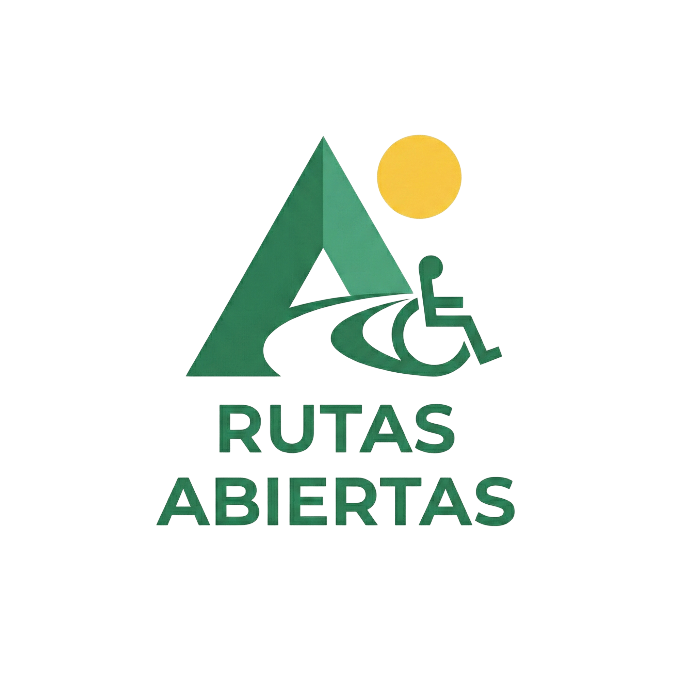

# Rutas Abiertas — Presentación Web

  
  
  
  **Una plataforma web para presentar el proyecto Rutas Abiertas**
  
  
  
  

---

## 📖 Sobre el Proyecto

**Rutas Abiertas** es una aplicación móvil colaborativa diseñada para identificar, registrar y compartir puntos accesibles en todo Chile, promoviendo la inclusión y derribando barreras de accesibilidad.

Esta **página de presentación web** muestra el proyecto de forma interactiva, incluyendo:
- 🎯 El contexto y problema que busca resolver
- 💡 La solución propuesta y casos de uso
- 🛠️ Metodología de desarrollo (SCRUM)
- 🏗️ Arquitectura técnica y tecnologías
- 📱 Capturas de pantalla de la aplicación móvil
- 👥 Información del equipo de desarrollo

---

## 🌟 Características de la Presentación

✨ **Diseño Responsivo** — Compatible con dispositivos móviles, tablets y escritorio  
🎨 **Animaciones Suaves** — Implementadas con AOS (Animate On Scroll)  
♿ **Accesibilidad** — Herramientas de alto contraste y aumento de fuente  
🧭 **Navegación Intuitiva** — Menú sticky con scroll suave  
📊 **Contenido Estructurado** — Secciones organizadas por temas

---

## 🌐 Visualización

Puedes ver la presentación en vivo visitando: [Rutas Abiertas](https://presentacion.rutasabiertas.app) 

---

## 👥 Equipo

| Rol | Nombre | Responsabilidad |
|-----|--------|----------------|
| **Scrum Master** | Mauro Zapata | Liderazgo ágil, gestión de proyecto y coordinación |
| **Desarrollador** | Carlos Salvo | Desarrollo móvil Android, integración y arquitectura |

---

## 🎯 Objetivo del Proyecto Principal

**Rutas Abiertas** busca crear un Chile más accesible e inclusivo, proporcionando una herramienta colaborativa para que más de 2 millones de personas con discapacidad puedan:

- 🔍 Buscar lugares accesibles cercanos
- ➕ Registrar nuevos puntos accesibles
- 🧭 Filtrar por tipo de accesibilidad (rampas, ascensores, baños adaptados)
- 📍 Planificar rutas sin barreras

---

## 📱 Sobre la Aplicación Móvil

La app móvil está desarrollada en:
- **Dart** con Flutter
- **MongoDB** Para almacenar los datos
- **Python**

---

## 💚 Contribuciones

Este proyecto forma parte de una iniciativa de inclusión digital. Si deseas contribuir o conocer más sobre el proyecto principal, no dudes en contactarnos.

---

## 📄 Licencia

Este proyecto es parte de un trabajo académico enfocado en accesibilidad e inclusión.

---

  
  **© 2026 Rutas Abiertas**
  
  *Desarrollado con 💚 para construir un Chile más accesible e inclusivo*
  

